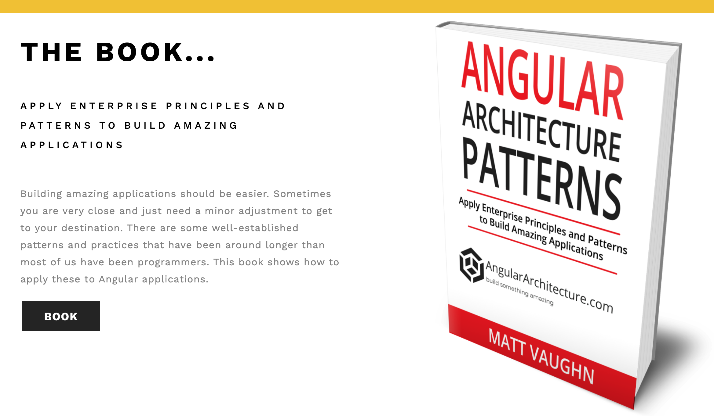

# Angular Library Types

The new project type *library* is generic enough for you to create almost any type of library that you deem necessary to organize your code, to share and reuse the library with other applications. There are no rules as to the type of library project that you create for your solution. Generally speaking though, you should create an organize the contents of your library to be specific to a single purpose. This follows the single responsibility rule and allows you to organize and group related things into a single library.

## Code Organization

// FIXME: ADD MORE CONTENT HERE; WHY?

- encapsulation: some things are exposed to consumers while others are hidden or encapsulated within the library.

## Material Design :: Library Examples

A good example of this is the Material Design packages for Angular. Initially all of the components for Material Design were contained in a single module. This might've seemed like a good design and way to publish an entire library of Angular Material components. However,  this meant that if you wanted to use one or a few Angular Material components you had to import *all* of the components that were contained in this module. This would definitely increase the size of the JavaScript bundles during the output of the build process. Later a decision was made to create a package for each component within the Angular Material Design.

Now we can import only the specific components using a module import for the specific features that we are working on. However, I do see some developers create a shared module to import all of the Material component modules as a convenience for the application. You should avoid doing this. For more information, please see this great article, ["Stop Using Shared Material Module"](https://indepth.dev/posts/1191/stop-using-shared-material-module) by Santosh Yadav ([@SantoshYadavDev](https://twitter.com/@SantoshYadavDev)).

## Shared UI Components

Since most of us are and angular developers we can anticipate the use of different common components within our application. These components are not domain specific or a feature specific components. Therefore, we can create a library of general use components that are basically reusable in different parts of our application as well as different features. If you decide to publish this library, other teams within your organization or other developers throughout the world might be able to use your package as part of their solution.

For example, you might have a *pipe* that formats numbers or dates that is specific to your application. Instead of copying this code into different applications, features, or modules you can create a library project that contains these pipes as a single source of truth. This way you only have a single set of code to manage and you can use the output in many different areas of your applications.

- Button
- Banner
- Growl
- Toaster
- Modal
- Notifiers
- Directives
- Pipes

## Cross-Cutting Concerns (Infrastructure)

As we work on different projects in different applications, you will find that there are many common or shared non-functional features of the application. Many times these are referred to as cross-cutting concerns. A cross-cutting concern is something that the application will use throughout the different layers or even the different vertical boundaries or features of your application.

An example of a cross0cutting concern is ***logging***. You can use a logging service or a library that has logging functionality to send information about your application to a centralized repository. You can send messages with informational, warning, or error data to this repository. This will allow developers or administrators of the application to monitor the application's health. This is vital especially for revenue generating applications.

> You could create a logging service module within your application. This single module can be reused throughout your application. However, if you create the logging service as a library, you can reuse this cross-cutting functionality within many applications and/or library projects. Therefore, you can see the value of using library projects for cross-cutting concerns.

### Common Cross-Cutting Concerns

The following table provides some common cross-cutting concerns that you might want to consider implementing as library projects for your applications. Note that these cross-cutting concern libraries can be reused by different applications and/or other library projects within your angular workspace. More abou this later.

| Library        | Description                                                                                                                                                                                                                                                                                                                                                                                                                                                                                                               |
| -------------- | ------------------------------------------------------------------------------------------------------------------------------------------------------------------------------------------------------------------------------------------------------------------------------------------------------------------------------------------------------------------------------------------------------------------------------------------------------------------------------------------------------------------------- |
| Configuration  | A ***configuration*** cross-cutting concern allows you to have a single mechanism for managing the settings for application and library projects. You can initialize a configuration service in the start up routine of the application. The configuration service will be injected into the applications global dependency injection injector.                                                                                                                                                                           |
| Error Handling | A ***error handling*** cross-concern is a great candidate to replace the default Angular `ErrHandler`. This allows the application to handle unexpected errors during the runtime of the application in a client browser. When an error occurs, you can then use the logging service to send the information to the centralized repository of log information.                                                                                                                                                            |
| Logging        | A ***logging*** cross-cutting concern allows the application to send information that is important to a centralized repository. Typically, a developer will use `console.log`. However, this is not appropriate when the application is in production and in use by our clients.                                                                                                                                                                                                                                          |
| HTTP Service   | An ***HTTP Service*** implemented as a library can be reused throughout the application to construct and execute API calls. Typically, most developer teams will have many variations of how to create and execute API calls; as well as handling the response from these API operations. Therefore, a single library can create a single source of truth or mechanism for handling these types of operations. This way this type of code can be tested more thoroughly for better quality and safety of the application. |
| Notifications  | Most web applications will require functionality to provide messages or ***notifications*** to the user. If you implement a notification service as a library, you can have a single mechanism to provide this type of information to different components to display this information.                                                                                                                                                                                                                                   |
| Analytics      | A typical non-functional requirement for web applications is ***web analytics***. You can create a library project to configure different analytic tools or platforms to collect information from your Angular application.                                                                                                                                                                                                                                                                                               |

## UI Feature

Some modern web architectures are now taking advantage of library projects to encapsulate UI features as libraries. In this scenario, you will have a shell application that will lazy-load a UI feature module from the library when a route is activated. This is a good code organization technique for Angular projects. In fact for enterprise Angular projects, the [Nx.dev](https://nx.dev/) team at [Nrwl.io](https://nrwl.io/) recommends using this architectural approach.

You can create a UI feature library for each of the vertical features within your application. This approach has the added advantage of being able to reuse any of these UI features in other applications as well. Here is a lit of a typical e-commerce application's feature UI libraries.

- products-ui
- orders-ui
- account-ui
- security-ui

## Domain Service

A ***domain service*** library can be used to contain the business logic for a specific feature of your application. This library will encapsulates all of the business logic for a feature. It will provide an entry-point to consumers of the library as an injectable service.

The following is a list of potential domain service libraries for a fictitious clinical application.

- Accounts
- Appointments
- Physicians
- Security

A domain service library provides a physical separation of concerns of your business logic code from the rest of the application. This will allow you to test the business logic differently than the UI logic of the application. Typically, these tests are easier to execute when there is no UI component involved.

> If your application is difficult to test, you might consider organizing your code differently in separate layers. Each layer of the application will have a different concern. This will allow for easier testing and smaller more contextual tests for different parts of your application. A good resource for this layered architecture is the [Clean Architecture book by Robert C. Martin](https://www.amazon.com/Clean-Architecture-Craftsmans-Software-Structure/dp/0134494164) (a.k.a. Uncle Bob).

I published the book [Angular Architecture Patterns](https://angulararchitecture.com/) that implements the layers of this architecture using the capablities of Angular, TypeScript, and Nx.dev.

## Shared Types

### API Response

### Domain Types (e.g., customer, product, order, etc.)

## Framework

### Rules Engine

### Business Actions

## Validators

### Custom asynchronous validators for Reactive Forms

### Email

### Password Strength

### Postal Codes

### Names

### Address