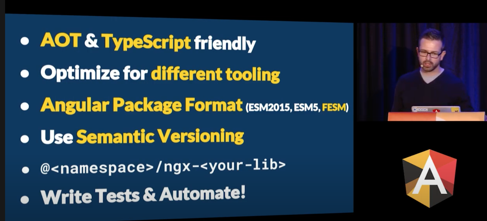

# Angular Package Format (Historical View)

## September 26, 2016

- [Angular-Library-Seed](https://github.com/preboot/angular-library-seed)
  - A Github starter kit of Angular 2 Libraries by [preboot](https://github.com/preboot)
  - Uses Angular 2.0.0 (See: [package.json history](https://github.com/preboot/angular-library-seed/commit/b7c658d598b37d98943aefd2fe739b88fbb148d2#diff-7ae45ad102eab3b6d7e7896acd08c427a9b25b346470d7bc6507b6481575d519))

## October 6, 2016

[how to publish angular 2 typescript library on npm](https://stackoverflow.com/questions/39517035/how-to-publish-angular-2-typescript-library-on-npm)

- answers that point to using a specific format for different module consumers
  - UMD
  - SystemJS
- Reference to: Yeoman generator to create a standalone Angular library in seconds.
  - Github.com: [generator-angular2-library](https://github.com/jvandemo/generator-angular2-library)

## December 14, 2016

[How to build and publish an Angular module](https://medium.com/@cyrilletuzi/how-to-build-and-publish-an-angular-module-7ad19c0b4464) by  Cyrille Tuzi ([@cyrilletuzi](https://twitter.com/cyrilletuzi))

- references creating and publishing an Angular *Module*
- build tools
  - minification/uglifying
- configuration for TypeScript and Rollup to support UMD format
- building and publishing to NPM

## January 17, 2017

[Distributing an Angular Library - The Brief Guide](https://webcache.googleusercontent.com/search?q=cache:GDnOotaku-4J:https://blog.mgechev.com/2017/01/21/distributing-an-angular-library-aot-ngc-types/+&cd=5&hl=en&ct=clnk&gl=us) by Minko Gechev ([@mgechev](https://twitter.com/mgechev))

## March 20, 2017

- [How to publish a library for Angular 2 on npm](https://medium.com/@OCombe/how-to-publish-a-library-for-angular-2-on-npm-5f48cdabf435)
  - references Minko's article from January 17, 2017
  - references [angular-library-seed](https://github.com/preboot/angular-library-seed) a package for a library starter kit for creating Angular libraries

## April 9, 2017

- [Packaging Angular (ng-conf)](https://www.youtube.com/watch?v=unICbsPGFIA) by Jason Aden ([@jasonaden1](https://twitter.com/jasonaden1?lang=en))
  - [Angular Package Format 4.0](https://docs.google.com/document/d/1t7DreFnEtZCQiSzrWggK8VGf-scQ5goWHloDhRwAOOo/edit#heading=h.k0mh3o8u5hx)
  - [Packaging Angular | Jason Aden | ng-conf 2017 Minified (YouTube Video)](https://www.youtube.com/watch?v=cnbfopTXP84)

## June 6, 2017

- [How to create AOT/JIT compatible Angular 4 library with external SCSS/HTML templates](https://trekhleb.medium.com/how-to-create-aot-jit-compatible-angular-4-library-with-external-scss-html-templates-9da6e68dac6e) by [Oleksii Trekhleb] ([@Trekhleb](https://twitter.com/Trekhleb))

## Jun 29, 2017

- [Design Doc: "ng-packagr"](https://webcache.googleusercontent.com/search?q=cache:iiRfn1nzh4kJ:https://github.com/ng-packagr/ng-packagr/blob/master/docs/DESIGN.md+&cd=2&hl=en&ct=clnk&gl=us) by David Herges ([@davidh_23](https://mobile.twitter.com/davidh_23))
  - Packaging TypeScript libraries in Angular Package Format
  - support for different build artifacts
  - public API entry point

> Currenty [ng-packagr](https://github.com/ng-packagr/ng-packagr) is a separate project/package that is a `peerDependency` for the Angular `@angular-devkit/build-angular` package.

## December 7, 2017

[Packaging Angular Libraries](https://webcache.googleusercontent.com/search?q=cache:oCwT53Rek0IJ:https://manuel-rauber.com/2017/12/06/packaging-angular-libraries/+&cd=3&hl=en&ct=clnk&gl=us) by Manuel Rauber ([@ManuelRauber](https://twitter.com/ManuelRauber))
  - using the linked typescript approach for development; with live reloading
  - references [Yeoman generator to bootstrap your Angular library creation and publication](https://github.com/tinesoft/generator-ngx-library) to support Angular Package Format
  - references [Angular Librarian on Github](https://github.com/gonzofish/angular-librarian)

## December 15, 2017

- Juri Strumpflohner ([@juristr](https://twitter.com/juristr)) - [Create and publish Angular libs like a Pro](https://www.youtube.com/watch?v=K4YMmwxGKjY)
  - smallest set of *logically connected code*
  - single module approach for individual components

## February 20, 2018

- ngAir Podcast Episode #149 - ng-packagr with David Herges ([@davidh_23](https://mobile.twitter.com/davidh_23))
  - using Angular Package Format
  - use to build Library projects for code sharing and reuse; publishing to NPM or sharing within an organization
    - private reuse publishing to an internal package registry
    - public
  - creates a set of JavaScript bundles with the correct assets for different formats
    - UMD: use script tag in HTML (e.g., Plunker)
    - ES2015
    - ES5
  - use EcmaScript modules for tree-shaking
  - simplifies the manual process of several steps into a single command
  - creates `typings` and `metadata`
  - package versioning
  - can use for plain TypeScript libraries (non-Angular)
  - see: https://github.com/jasonaden/angular-cli-lib-example

> David: "The future is (Angular) version 6...fingers crossed that we make it and get ng-packagr into version 6 of Angular and the CLI."

## May 6, 2020

[Angular Package Format (APF) v10.0](https://docs.google.com/document/d/1uh2D6XqaGh2yjjXwfF4SrJqWl1MBhMPntlNBBsk6rbw/edit#heading=h.k0mh3o8u5hx)

## April 15, 2021

[Angular Package Format (APF) v12.0](https://docs.google.com/document/d/1CZC2rcpxffTDfRDs6p1cfbmKNLA6x5O-NtkJglDaBVs/preview#heading=h.k0mh3o8u5hx)