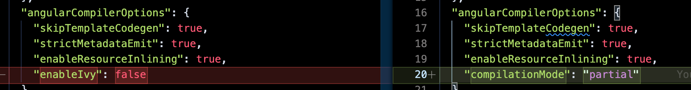

# Publishing and Distributing Angular Libraries

One of the main reasons to create a custom library is to make it available to the general public. Or, to publish it for consumption by your organization and internal developers and other teams within your organization. To do this, you will need a package registry such as [NPM](https://www.npmjs.com/) or [JFrog's Artifactory](https://jfrog.com/artifactory/) if you are publishing to an internal repository for your organization.

> You have the option to make your package public or private.

 If you create and maintain a public package, you are essentially helping the open source community by sharing your knowledge and experience by way of the new library. This *package* can be consumed by other applications and allow them to use the code that you've written many times over. Additionally, you can make the source code repository public to allow the developer community to contribute and help maintain the project.

## Publishing to NPM

> 1. create an account https://npmjs.com
> 2. create and build your library (i.e., pacakge)
> 3. go to the dist folder and login: `npm login`
> 4. use the `npm publish` command to publish the package

```json
{
  "name": "error-handler",
  "version": "0.0.1",
  "peerDependencies": {
    "@angular/common": "^11.2.14",
    "@angular/core": "^11.2.14"
  },
  "dependencies": {
    "tslib": "^2.0.0"
  },
  "main": "bundles/error-handler.umd.js",
  "module": "fesm2015/error-handler.js",
  "es2015": "fesm2015/error-handler.js",
  "esm2015": "esm2015/error-handler.js",
  "fesm2015": "fesm2015/error-handler.js",
  "typings": "error-handler.d.ts",
  "sideEffects": false,
  "scripts": {
    "prepublishOnly": "node --eval \"console.error('ERROR: Trying to publish a package that has been compiled by Ivy. This is not allowed.\\nPlease delete and rebuild the package, without compiling with Ivy, before attempting to publish.\\n')\" && exit 1"
  }
}
```

### Update the Package.json

- version
- description
- author
- license
- repository

```json
  
{
  "name": "@angular/core",
  "version": "0.0.0-PLACEHOLDER",
  "description": "Angular - the core framework",
  "author": "angular",
  "license": "MIT",
  "engines": {
    "node": "^12.14.1 || >=14.0.0"
  },
  "dependencies": {
    "tslib": "^2.3.0"
  },
  "peerDependencies": {
    "rxjs": "^6.5.3 || ^7.0.0",
    "zone.js": "~0.11.4"
  },
  "repository": {
    "type": "git",
    "url": "https://github.com/angular/angular.git",
    "directory": "packages/core"
  },
  "ng-update": {
    "migrations": "./schematics/migrations.json",
    "packageGroup": "NG_UPDATE_PACKAGE_GROUP"
  },
  "sideEffects": false
}
```

## Version

> [npmjs.com/version](https://docs.npmjs.com/cli/v8/configuring-npm/package-json#version): If you plan to publish your package, the most important things in your package.json are the name and version fields as they will be required. The name and version together form an identifier that is assumed to be completely unique. Changes to the package should come along with changes to the version. If you don't plan to publish your package, the name and version fields are optional.
## Building and Publishing Libraries

> Workaround: [Deploying Angular # ivy packages](https://szoradi-balazs.medium.com/deploying-angular-9-ivy-packages-bae9841e665c)

###  Fix 1: Build Package Using `--prod`

```ts
ng build errorHandler --prod     
Building Angular Package

------------------------------------------------------------------------------
Building entry point 'error-handler'
------------------------------------------------------------------------------
✔ Compiling TypeScript sources through NGC
✔ Bundling to FESM2015
✔ Bundling to UMD
✔ Minifying UMD bundle
✔ Writing package metadata
ℹ Built error-handler

------------------------------------------------------------------------------
Built Angular Package
 - from: /Users/user/work/github/ijs-custom-angular-libraries/angular-workspace/projects/error-handler
 - to:   /Users/user/work/github/ijs-custom-angular-libraries/angular-workspace/dist/error-handler
------------------------------------------------------------------------------
npm publish
npm notice 
npm notice 📦  angular-workspace@0.0.0
npm notice === Tarball Contents === 
npm notice 274B  .editorconfig                                                 
npm notice 1.0kB README.md                                                     
npm notice 1.5kB angular.json                                                  
npm notice 1.2kB package.json                                                  
npm notice 1.4kB projects/error-handler/karma.conf.js                          
npm notice 162B  projects/error-handler/ng-package.json                        
npm notice 194B  projects/error-handler/package.json                           
npm notice 1.0kB projects/error-handler/README.md                              
npm notice 669B  projects/error-handler/src/lib/error-handler.component.spec.ts
npm notice 284B  projects/error-handler/src/lib/error-handler.component.ts     
npm notice 273B  projects/error-handler/src/lib/error-handler.module.ts        
npm notice 388B  projects/error-handler/src/lib/error-handler.service.spec.ts  
npm notice 141B  projects/error-handler/src/lib/error-handler.service.ts       
npm notice 183B  projects/error-handler/src/public-api.ts                      
npm notice 781B  projects/error-handler/src/test.ts                            
npm notice 540B  projects/error-handler/tsconfig.lib.json                      
npm notice 230B  projects/error-handler/tsconfig.lib.prod.json                 
npm notice 309B  projects/error-handler/tsconfig.spec.json                     
npm notice 247B  projects/error-handler/tslint.json                            
npm notice 911B  tsconfig.json                                                 
npm notice 3.0kB tslint.json                                                   
npm notice === Tarball Details === 
npm notice name:          angular-workspace                       
npm notice version:       0.0.0                                   
npm notice filename:      angular-workspace-0.0.0.tgz             
npm notice package size:  5.1 kB                                  
npm notice unpacked size: 14.8 kB                                 
npm notice shasum:        8a96bd2271da546b128620d4c653651260ddc644
npm notice integrity:     sha512-UgCjKya4h+/SU[...]3WpCAyDwUUOIA==
npm notice total files:   21                                      
npm notice 
npm ERR! code ENEEDAUTH
npm ERR! need auth This command requires you to be logged in.
npm ERR! need auth You need to authorize this machine using `npm adduser`
```

###  Fix 2: Publish Package with `--ignore-scripts`

```ts
ng build errorHandler

Building Angular Package
******************************************************************************
It is not recommended to publish Ivy libraries to NPM repositories.
Read more here: https://v9.angular.io/guide/ivy#maintaining-library-compatibility
******************************************************************************

------------------------------------------------------------------------------
Building entry point 'error-handler'
------------------------------------------------------------------------------
✔ Compiling TypeScript sources through NGC
⠋ Bundling to FESM2015(node:8661) [DEP0148] DeprecationWarning: Use of deprecated folder mapping "./" in the "exports" field module resolution of the package at /Users/user/work/github/ijs-custom-angular-libraries/angular-workspace/node_modules/tslib/package.json.
Update this package.json to use a subpath pattern like "./*".
(Use `node --trace-deprecation ...` to show where the warning was created)
✔ Bundling to FESM2015
✔ Bundling to UMD
✔ Minifying UMD bundle
✔ Writing package metadata
ℹ Built error-handler

------------------------------------------------------------------------------
Built Angular Package
 - from: /Users/user/work/github/ijs-custom-angular-libraries/angular-workspace/projects/error-handler
 - to:   /Users/user/work/github/ijs-custom-angular-libraries/angular-workspace/dist/error-handler
------------------------------------------------------------------------------
npm publish --ignore-scripts
npm notice 
npm notice 📦  angular-workspace@0.0.0
npm notice === Tarball Contents === 
npm notice 274B  .editorconfig                                                 
npm notice 1.0kB README.md                                                     
npm notice 1.5kB angular.json                                                  
npm notice 1.2kB package.json                                                  
npm notice 1.4kB projects/error-handler/karma.conf.js                          
npm notice 162B  projects/error-handler/ng-package.json                        
npm notice 194B  projects/error-handler/package.json                           
npm notice 1.0kB projects/error-handler/README.md                              
npm notice 669B  projects/error-handler/src/lib/error-handler.component.spec.ts
npm notice 284B  projects/error-handler/src/lib/error-handler.component.ts     
npm notice 273B  projects/error-handler/src/lib/error-handler.module.ts        
npm notice 388B  projects/error-handler/src/lib/error-handler.service.spec.ts  
npm notice 141B  projects/error-handler/src/lib/error-handler.service.ts       
npm notice 183B  projects/error-handler/src/public-api.ts                      
npm notice 781B  projects/error-handler/src/test.ts                            
npm notice 540B  projects/error-handler/tsconfig.lib.json                      
npm notice 230B  projects/error-handler/tsconfig.lib.prod.json                 
npm notice 309B  projects/error-handler/tsconfig.spec.json                     
npm notice 247B  projects/error-handler/tslint.json                            
npm notice 911B  tsconfig.json                                                 
npm notice 3.0kB tslint.json                                                   
npm notice === Tarball Details === 
npm notice name:          angular-workspace                       
npm notice version:       0.0.0                                   
npm notice filename:      angular-workspace-0.0.0.tgz             
npm notice package size:  5.1 kB                                  
npm notice unpacked size: 14.8 kB                                 
npm notice shasum:        8a96bd2271da546b128620d4c653651260ddc644
npm notice integrity:     sha512-UgCjKya4h+/SU[...]3WpCAyDwUUOIA==
npm notice total files:   21                                      
npm notice 
npm ERR! code ENEEDAUTH
npm ERR! need auth This command requires you to be logged in.
npm ERR! need auth You need to authorize this machine using `npm adduser`

npm ERR! A complete log of this run can be found in:
npm ERR!     /Users/user/.npm/_logs/2021-09-18T04_26_59_995Z-debug.log

```

### Fix 3: TSConfig with `"enableIvy": false`

Add and set the `enableIvy` attribute of the `angularCompilerOptions` to *false* - in the `projects/error-handler/tsconfig.lib.json` file.

*projects/error-handler/tsconfig.lib.json*
```json
  "angularCompilerOptions": {
    "skipTemplateCodegen": true,
    "strictMetadataEmit": true,
    "enableResourceInlining": true,
    "enableIvy": false
  },
```

You can build your library project. The output of the `package.json` file will not include the `prepublishOnly` script item.

```json
{
  "name": "error-handler",
  "version": "0.0.1",
  "peerDependencies": {
    "@angular/common": "^11.2.14",
    "@angular/core": "^11.2.14"
  },
  "dependencies": {
    "tslib": "^2.0.0"
  },
  "main": "bundles/error-handler.umd.js",
  "module": "fesm2015/error-handler.js",
  "es2015": "fesm2015/error-handler.js",
  "esm2015": "esm2015/error-handler.js",
  "fesm2015": "fesm2015/error-handler.js",
  "typings": "error-handler.d.ts",
  "metadata": "error-handler.metadata.json",
  "sideEffects": false
}
```

Run the `npm publish` command in the output folder of the build (e.g., `dist/error-handler`).

```ts
npm publish
npm notice 
npm notice 📦  error-handler@0.0.1
npm notice === Tarball Contents === 
npm notice 1.0kB README.md                             
npm notice 2.5kB bundles/error-handler.umd.js          
npm notice 1.8kB bundles/error-handler.umd.js.map      
npm notice 1.1kB bundles/error-handler.umd.min.js      
npm notice 1.4kB bundles/error-handler.umd.min.js.map  
npm notice 121B  error-handler.d.ts                    
npm notice 176B  error-handler.d.ts.map                
npm notice 1.3kB error-handler.metadata.json           
npm notice 508B  esm2015/error-handler.js              
npm notice 1.3kB esm2015/lib/error-handler.component.js
npm notice 1.4kB esm2015/lib/error-handler.module.js   
npm notice 1.2kB esm2015/lib/error-handler.service.js  
npm notice 808B  esm2015/public-api.js                 
npm notice 1.4kB fesm2015/error-handler.js             
npm notice 1.8kB fesm2015/error-handler.js.map         
npm notice 199B  lib/error-handler.component.d.ts      
npm notice 269B  lib/error-handler.component.d.ts.map  
npm notice 94B   lib/error-handler.module.d.ts         
npm notice 189B  lib/error-handler.module.d.ts.map     
npm notice 115B  lib/error-handler.service.d.ts        
npm notice 193B  lib/error-handler.service.d.ts.map    
npm notice 506B  package.json                          
npm notice 176B  public-api.d.ts                       
npm notice 207B  public-api.d.ts.map                   
npm notice === Tarball Details === 
npm notice name:          error-handler                           
npm notice version:       0.0.1                                   
npm notice filename:      error-handler-0.0.1.tgz                 
npm notice package size:  5.6 kB                                  
npm notice unpacked size: 19.7 kB                                 
npm notice shasum:        a406cff279c3971a8c74baa0c10ff86ff3dc28c8
npm notice integrity:     sha512-tWrd3/ezjvOhD[...]V9DLTFc+aPJYg==
npm notice total files:   24                                      
npm notice 
npm ERR! code ENEEDAUTH
npm ERR! need auth This command requires you to be logged in.
npm ERR! need auth You need to authorize this machine using `npm adduser`
```

### Fix 4: TSConfig with `"compilationMode": "partial"`

> Angular.io :: See [Transitioning libraries to partial-Ivy format](https://angular.io/guide/creating-libraries#transitioning-libraries-to-partial-ivy-format)

1. remove the `enableIvy`
2. add `compilationMode` with a value of `partial`



The `angularCompilerOptions` section in the `projects/error-handler/tsconfig.lib.json` should look like this:

```json
"angularCompilerOptions": {
  "skipTemplateCodegen": true,
  "strictMetadataEmit": true,
  "enableResourceInlining": true,
  "compilationMode": "partial"
},
```

Directly from the Angular documentation: 

> For publishing to npm use the partial-Ivy format as it is stable between patch versions of Angular.
> 
> Avoid compiling libraries with full-Ivy code if you are publishing to npm because the generated Ivy instructions are not part of Angular's public API, and so might change between patch versions.
> 
> Partial-Ivy code is not backward compatible with View Engine. If you use the library in a View Engine application, you must compile the library into the View Engine format by setting "enableIvy": false in the tsconfig.json file.
> 
> Ivy applications can still consume the View Engine format because the Angular compatibility compiler, or ngcc, can convert it to Ivy.

#### Build the Package

Use the `ng build errorHandler` CLI command to build the library.

```ts
ng build errorHandler
Building Angular Package
******************************************************************************
It is not recommended to publish Ivy libraries to NPM repositories.
Read more here: https://v9.angular.io/guide/ivy#maintaining-library-compatibility
******************************************************************************

------------------------------------------------------------------------------
Building entry point 'error-handler'
------------------------------------------------------------------------------
✔ Compiling TypeScript sources through NGC
⠋ Bundling to FESM2015(node:10260) [DEP0148] DeprecationWarning: Use of deprecated folder mapping "./" in the "exports" field module resolution of the package at /Users/user/work/github/ijs-custom-angular-libraries/angular-workspace/node_modules/tslib/package.json.
Update this package.json to use a subpath pattern like "./*".
(Use `node --trace-deprecation ...` to show where the warning was created)
✔ Bundling to FESM2015
✔ Bundling to UMD
✔ Minifying UMD bundle
✔ Writing package metadata
ℹ Built error-handler

------------------------------------------------------------------------------
Built Angular Package
 - from: /Users/user/work/github/ijs-custom-angular-libraries/angular-workspace/projects/error-handler
 - to:   /Users/user/work/github/ijs-custom-angular-libraries/angular-workspace/dist/error-handler
------------------------------------------------------------------------------
```

#### Publish

Open the `projects/error-handler` path in terminal and run the `npm publish` command.

```ts
npm publish
npm notice 
npm notice 📦  error-handler@0.0.1
npm notice === Tarball Contents === 
npm notice 1.0kB README.md                              
npm notice 1.4kB karma.conf.js                          
npm notice 162B  ng-package.json                        
npm notice 194B  package.json                           
npm notice 669B  src/lib/error-handler.component.spec.ts
npm notice 284B  src/lib/error-handler.component.ts     
npm notice 273B  src/lib/error-handler.module.ts        
npm notice 388B  src/lib/error-handler.service.spec.ts  
npm notice 141B  src/lib/error-handler.service.ts       
npm notice 183B  src/public-api.ts                      
npm notice 781B  src/test.ts                            
npm notice 574B  tsconfig.lib.json                      
npm notice 230B  tsconfig.lib.prod.json                 
npm notice 309B  tsconfig.spec.json                     
npm notice 247B  tslint.json                            
npm notice === Tarball Details === 
npm notice name:          error-handler                           
npm notice version:       0.0.1                                   
npm notice filename:      error-handler-0.0.1.tgz                 
npm notice package size:  3.0 kB                                  
npm notice unpacked size: 6.9 kB                                  
npm notice shasum:        8194f8c2a7663a6c9a22fb6c3c95f38487ff3c60
npm notice integrity:     sha512-bITpnjgPUDJ/R[...]9auU1nEMZiBQw==
npm notice total files:   15                                      
npm notice 
npm ERR! code ENEEDAUTH
npm ERR! need auth This command requires you to be logged in.
npm ERR! need auth You need to authorize this machine using `npm adduser`
```

## Details On How To Publish Locally and to Npm

## Managing Custom Libraries Versions